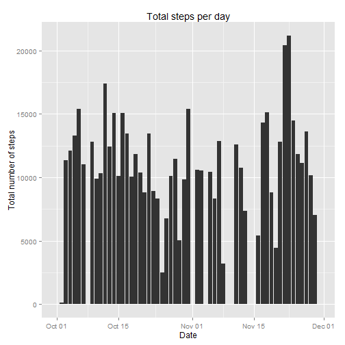
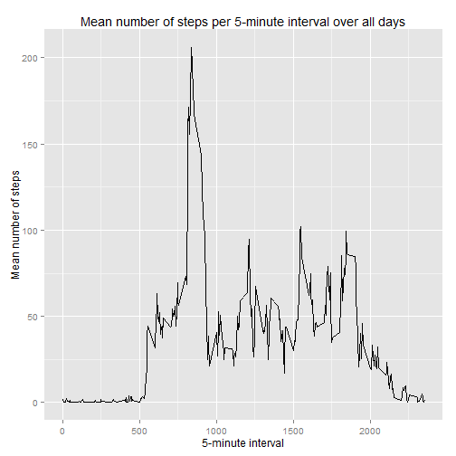
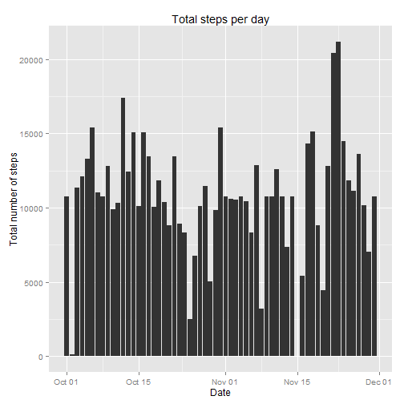
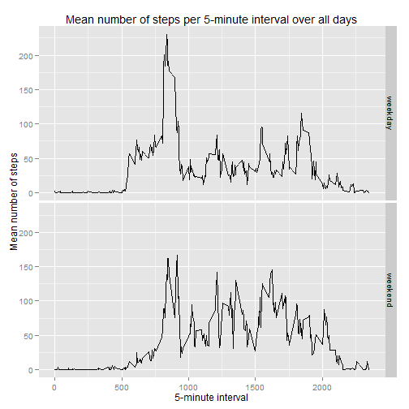

# Reproducible Research: Peer Assessment 1


This report shows the code and results of the analysis for Peer Assessment 1 of the Reproducible Research course.


## Loading and preprocessing the data

We begin by loading the required packages for the analysis. We use `data.table` for ease of data manipulation and `ggplot2` for plotting.


```r
library(data.table)
library(ggplot2)
```

In order to run this analysis, the file `activity.zip` must by in the working directory. We convert the columns to
their repective data types.


```r
unzip("activity.zip")
d <- data.table(read.csv("activity.csv",colClasses=c("numeric","Date","integer")))
```


## What is the mean total number of steps taken per day?

We begin by calculating the total number of steps taken per day in a new `data.table`.

```r
byday <- d[,list(totalsteps=sum(steps,na.rm=TRUE)),by=date]
```

We then use `ggplot2` to create a histogram of total number of steps per day

```r
qplot(x=date,y=totalsteps,data=byday,
      geom="bar",
      stat="identity",
      xlab="Date",
      ylab="Total number of steps",
      main="Total steps per day"
)
```

 

Using `byday`, we compute the mean and median total number of steps taken per day.

```r
mean(byday$totalsteps,na.rm=TRUE)
```

```
## [1] 9354
```

```r
median(byday$totalsteps,na.rm=TRUE)
```

```
## [1] 10395
```


## What is the average daily activity pattern?

We begin by calculating the mean number of steps per interval over all days in a new `data.table`.

```r
byint <- d[,list(meansteps=mean(steps,na.rm=TRUE)),by=interval]
```

We then use `ggplot` to create a line plot of the the mean number of steps per interval.

```r
qplot(x=interval,y=meansteps,data=byint,
      geom="line",
      xlab="5-minute interval",
      ylab="Mean number of steps",
      main="Mean number of steps per 5-minute interval over all days"
)
```

 

Using `byday` we then find the interval with the maximum average number of steps over all days.

```r
byint[meansteps==max(meansteps),interval]
```

```
## [1] 835
```


## Imputing missing values

We first determine the total number of missing values in the dataset.


```r
d[is.na(steps),.N]
```

```
## [1] 2304
```

We fill in all missing values in the dataset with the mean number of steps of their respective 5-minute interval. 
The new filled in values will be put in a new copy of the original dataset.


```r
d2 <- merge(d,byint,by="interval")
d2[is.na(steps),steps:=meansteps]
d2 <- d2[,list(steps,date,interval)][order(date,interval)]
```

Using `ggplot2`, we create a histogram of the total number of steps taken each day with the newly filled-in values.

```r
byday2 <- d2[,list(totalsteps=sum(steps,na.rm=TRUE)),by=date]
qplot(x=date,y=totalsteps,data=byday2,
      geom="bar",
      stat="identity",
      xlab="Date",
      ylab="Total number of steps",
      main="Total steps per day"
)
```

 

We then calculate the mean and median total number of steps taken per day with the newly filled-in values.

```r
mean(byday2$totalsteps,na.rm=TRUE)
```

```
## [1] 10766
```

```r
median(byday2$totalsteps,na.rm=TRUE)
```

```
## [1] 10766
```
The means and median increase significantly by imputing missing data. Also, the total daily number of steps increase significantly, particularly on the days where all values were missing.

## Are there differences in activity patterns between weekdays and weekends?

Create a new factor variable with two levels - "weekday" and "weekend" indicating whether a given date is a weekday or weekend.

```r
d2[weekdays(date) %in% c("Saturday","Sunday"),daytype:="weekend"]
d2[!(weekdays(date) %in% c("Saturday","Sunday")),daytype:="weekday"]
d2[,daytype:=factor(daytype)]
```

We then make a faceted/panel line plot with `ggplot2` to compare the mean number of steps per interval for weekdays and weekends.

```r
byint2 <- d2[,list(meansteps=mean(steps,na.rm=TRUE)),by=list(interval,daytype)]
qplot(x=interval,y=meansteps,data=byint2,
      facets="daytype ~ .",
      geom="line",
      xlab="5-minute interval",
      ylab="Mean number of steps",
      main="Mean number of steps per 5-minute interval over all days"
)
```

 

